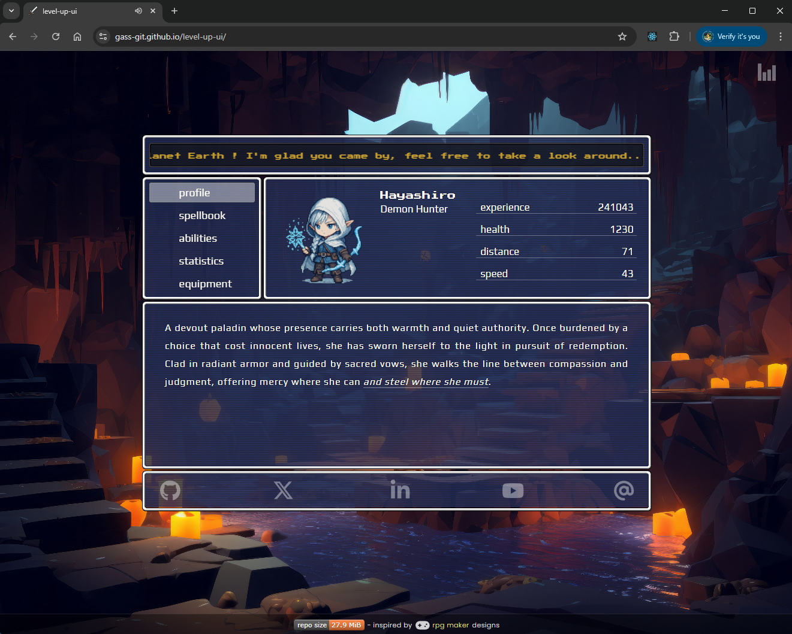

# ⚔️ Level up UI

React single page application, inspired by [RPG Maker](https://www.rpgmakerweb.com/) design.

[Live demo](https://gass-git.github.io/level-up-ui/)



## Features

### ✔️ Configure different aspects of the app within a single config file

### ✔️ Responsive design

### ✔️ Add and modify all content within a centralized data file

## Run locally

### Clone repository

```
git clone https://github.com/gass-git/level-up-ui.git
```

### Install dependencies

Within the repository directory, run:

```
npm i
```

### run locally

```
npm run dev
```

## Build your own distribution

```
npm run build
```

## Configuration

### In `src/config.ts` you can configure the following:

- Router basename (example: `/level-up-ui` in `gass-git.github.io/level-up-ui/`)
- Width of the main container
- Width in pixels of character profile summary next to the menu
- Interval timer (ms) for top message scroller
- Enable or disable water drops effect on the background
- Site sections

### In `src/data.tsx` you can set:

- The messages been shown on the top scroller
- The avatar, name, vocation and attributes of the character
- The content being shown in each section

### Social links:

To give maximum freedom in terms of customization, the social links and copy email functionality will require
modifying the component JSX directly. This can be done in `src/components/Links.tsx`.
